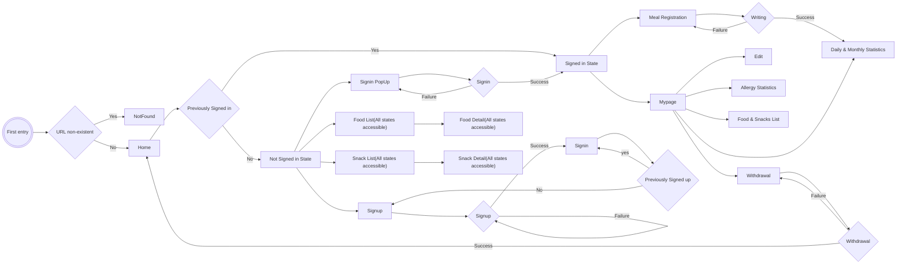
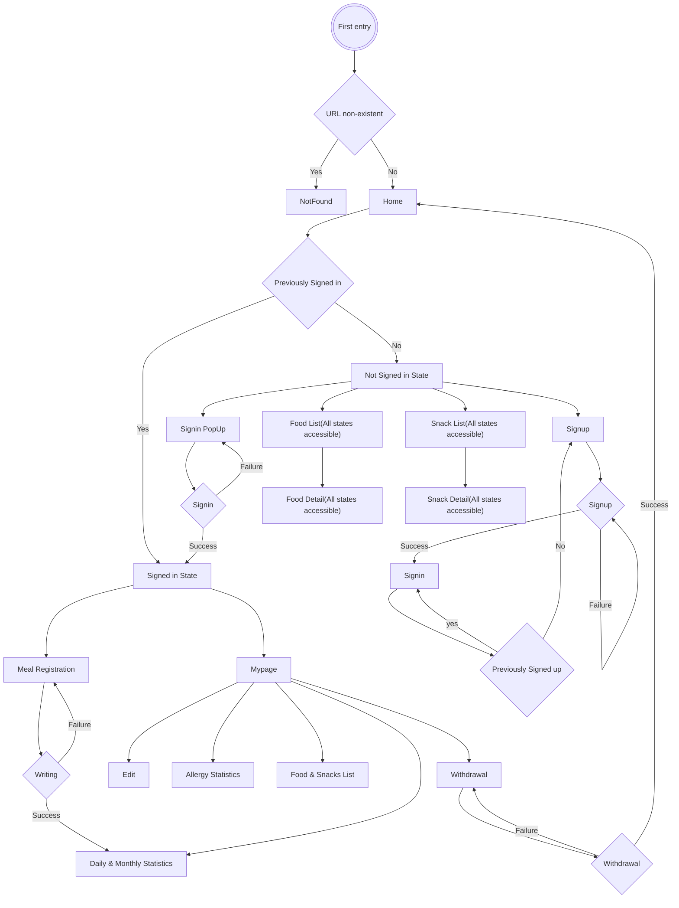

# 플로우차트 설명

## Allini 사용자 탐색

이 플로우차트는 Allini 애플리케이션 사용자의 페이지 탐색 흐름을 보여줍니다. 각 노드와 화살표는 특정 상태나 동작에 해당하며, 성공 또는 실패에 따라 사용자를 안내합니다.

### 로그인 및 가입

- **로그인 (Signin):** 이미 로그인된 상태 및 성공적인 로그인은 사용자를 로그인된 상태 (Signed in State)로 이동시킵니다.

  - 로그인이 실패하면 사용자는 다시 시도 하거나 가입 (Signup)으로 이동할 수 있습니다.

- **가입 (Signup):** 이미 가입되어 있다면 로그인 페이지로 이동하세요. 가입에 성공 하셨다면 로그인 페이지(Signin)로 이동시킵니다.
  - 가입이 실패하면 사용자는 다시 시도 할 수 있습니다.

### Allini 서비스 페이지

- **홈 (Home):** 메인 페이지를 나타냅니다.
- **마이페이지 (Mypage):** 사용자의 개인정보 및 활동기록 페이지입니다.
- **사료/간식 등록 (Meal Registration):** 우리 강아지의 사료 및 간식을 등록합니다.
  - 등록 성공 시 일일 및 월별 통계 (Daily & Monthly Statistics)로 이동하고, 실패 시 식사 등록을 다시 시도 할 수 있습니다.
- **정보 편집 (Edit):** 사용자 본인의 정보 및 우리 강아지의 정보를 편집할 수 있습니다.
- **알레르기 반응 통계 (Allergy Statistics):** 일일 및 주간/월별 통계를 표시합니다.
- **사료 및 간식 목록 (Food & Snacks List):** 사용자 본인이 작성했던 우리 강아지의 사료 및 간식 목록 페이지입니다.
- **탈퇴 (Withdrawal):** 사용자가 플랫폼에서 탈퇴할 수 있습니다.
  - 성공 시 메인 페이지 (Home)로 이동하고, 실패 시 탈퇴를 다시 시도 할 수 있습니다.

### 접근성

- **사료 목록 (Food List) 및 상세 (Food Detail):** 로그인/비로그인 사용자 모두 접근 가능합니다.
- **간식 목록 (Snack List) 및 상세 (Snack Detail):** 로그인/비로그인 사용자 모두 접근 가능합니다.
- **로그인, 회원가입을 제외한 나머지 페이지:** 로그인 사용자만 접근 가능합니다.

이 플로우차트는 홈페이지에 대한 사용자의 이용 방법을 시각적으로 제시하여 Allini 애플리케이션의 서비스 페이지에서의 다양한 상태와 동작을 이해하기 쉽게 합니다.
