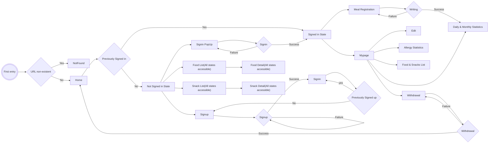

```mermaid
flowchart LR
A(((First entry))) --> NO{URL non-existent} --> |Yes| Q[NotFound]
NO{URL non-existent} --> |No| B[Home] --> R{Previously Signed in} --> |Yes| Z[Signed in State]
R{Previously Signed in} --> |No| Y[Not Signed in State]

Z --> G[Mypage]
Z --> F[Meal Registration]
--> U{Writing}  --> |Failure| F
U{Writing}  --> |Success| O[Daily & Monthly Statistics]
G --> L[Edit]
G --> M[Allergy Statistics]
G --> O[Daily & Monthly Statistics]
G --> P[Food & Snacks List]
G --> V[Withdrawal]
--> T{Withdrawal} --> |Failure| V
T{Withdrawal} --> |Success| B

Y --> D[Signup]
Y --> C[Signin PopUp] --> X{Signin} --> |Success| Z
X{Signin} --> |Failure| C
E[Signin] --> W{Previously Signed up} --> |yes| E
W{Previously Signed up} --> |No| D
D --> S{Signup} --> |Success| E
S{Signup} --> |Failure| S

Y --> I["Food List(All states accessible)"] --> K["Food Detail(All states accessible)"]
Y --> H["Snack List(All states accessible)"] --> J["Snack Detail(All states accessible)"]
```
